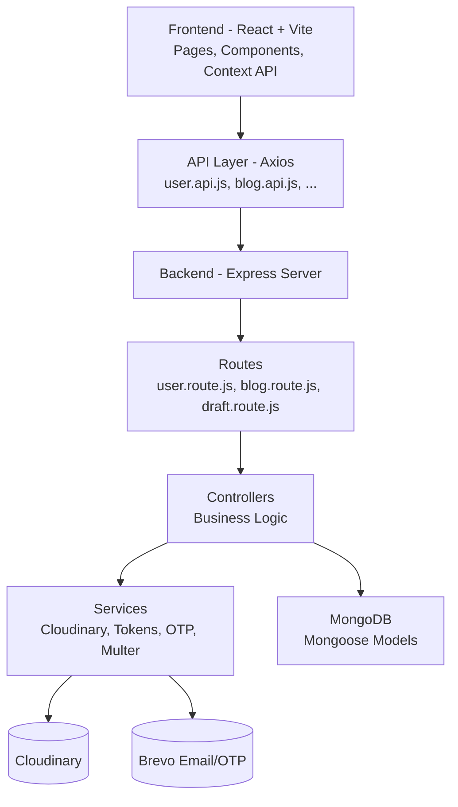

# 🚀 DevMark — Full-Stack Developer Blogging & Networking Platform

DevMark is a full-stack blogging and developer-networking platform built completely from scratch using **React + Vite**, **Node.js**, **Express**, and **MongoDB**.

It allows developers to publish blogs, save drafts, follow others, like/comment on posts, update their profile, upload avatars, and explore a personalized feed — similar to Medium, Hashnode, and Dev.to.

---

## ⭐ Features

### 🔐 Authentication
- Signup & Login  
- Email verification (OTP based)  
- Forgot password  
- JWT access + refresh tokens  
- Protected routes (frontend + backend)

### 🧑‍💻 User Profiles
- View & edit profile  
- Avatar upload (Cloudinary)  
- Skills, bio, and social links  
- Public developer profile  
- Stats: followers, blogs, likes, saves

### ✍️ Blog System
- Create, edit, delete blogs  
- Upload images  
- Draft support  
- My Blogs page  
- Bookmark/save blogs  
- Optimized feed and blog querying

### 🧾 Drafts System
- Auto-save drafts  
- Edit drafts anytime  
- Convert drafts to published blogs

### 📰 Feed & Explore
- Infinite scrolling feed  
- Trending tags  
- Suggested developers  
- Personalized recommendations

### 💬 Social Features
- Like / Unlike blogs  
- Comment on blogs  
- Follow / Unfollow users  
- Save blogs (bookmarks)

---

## 🏗️ Tech Stack

### Frontend
- React + Vite  
- React Router  
- Context API  
- Axios  
- Custom reusable UI components  
- Cloudinary upload support

### Backend
- Node.js  
- Express.js  
- MongoDB + Mongoose  
- JWT authentication  
- Brevo for email/OTP  
- Cloudinary for file uploads  
- Multer for parsing form-data

---

## 📁 Project Structure

### Frontend
```
client/
 ├── src/
 │   ├── api/               # API wrappers
 │   ├── components/        # Reusable UI components
 │   ├── context/           # Auth context provider
 │   ├── pages/             # Route pages (feed, blogs, auth, profile)
 │   ├── App.jsx            # Main routing file
 │   └── main.jsx           # React root
 └── package.json
```

### Backend
```
server/
 ├── src/
 │   ├── controllers/       # Business logic
 │   ├── routes/            # Express routes
 │   ├── models/            # Mongoose schemas
 │   ├── services/          # Cloudinary, mail, OTP, tokens
 │   ├── middlewares/       # Auth, multer, role checks
 │   ├── index.js
 │   └── server.js
 └── package.json
```

---

## 🔌 API Overview

### User
```
POST   /users/register
POST   /users/login
GET    /users/is-logged-in
POST   /users/avatar
PUT    /users/update
```

### Blogs
```
POST   /blogs/create
PUT    /blogs/update/:id
DELETE /blogs/delete/:id
GET    /blogs/user/:id
GET    /blogs/feed
```

### Drafts
```
POST   /drafts
PUT    /drafts/:id
DELETE /drafts/:id
GET    /drafts/user
```

### Social
```
POST   /follow/:id
POST   /like/:blogId
POST   /comment/:blogId
GET    /save/:blogId
```

---

## ⚙️ Setup Instructions

### Backend
```
cd server
npm install
cp .env.example .env
npm run dev
```

Example `.env`:
```
MONGO_URI=
ACCESS_TOKEN_SECRET=
REFRESH_TOKEN_SECRET=
CLOUDINARY_NAME=
CLOUDINARY_KEY=
CLOUDINARY_SECRET=
BREVO_API_KEY=
```

### Frontend
```
cd client
npm install
npm run dev
```

---

# 🧩 Architecture Diagram

## ASCII Architecture Diagram

```
                    ┌─────────────────────────────────────┐
                    │              FRONTEND                │
                    │        React + Vite + Context        │
                    └─────────────────────────────────────┘
                                   │
                                   ▼
                    ┌─────────────────────────────────────┐
                    │        API Layer (Axios)            │
                    │ user.api.js / blog.api.js / ...     │
                    └─────────────────────────────────────┘
                                   │
                        HTTP (JSON + FormData)
                                   │
                                   ▼
          ┌────────────────────────────────────────────────────────┐
          │                        BACKEND                         │
          │               Node.js + Express Server                 │
          ├────────────────────────────────────────────────────────┤
          │ Routes → Controllers → Services → Models               │
          │   user.route.js → user.controller.js                   │
          │   blog.route.js → blog.controller.js                   │
          │   draft.route.js → draft.controller.js                 │
          │   social routes: follow / like / comment / save        │
          └────────────────────────────────────────────────────────┘
                                   │
                                   ▼
          ┌────────────────────────────────────────────────────────┐
          │                         SERVICES                      │
          │ Cloudinary (Images)    │    Brevo (Email/OTP)         │
          │ Token generation       │    Multer (File parsing)     │
          └────────────────────────────────────────────────────────┘
                                   │
                                   ▼
          ┌────────────────────────────────────────────────────────┐
          │                       DATABASE                         │
          │                     MongoDB (Atlas)                    │
          │ Users / Blogs / Drafts / Likes / Comments / Saves     │
          └────────────────────────────────────────────────────────┘
```

---

## Mermaid Diagram (paste into README for visual diagram on GitHub)



---

## 🏁 Conclusion

DevMark is a feature-rich, production-grade MERN application with clean architecture, modular separation, scalable backend logic, and deeply functional frontend.

If you want:
- Badges (React, Node, MongoDB, etc.)  
- Demo screenshots section  
- API documentation table  
- ER diagram  
- Contribution & license section  

Just tell me — I can extend the README further.

